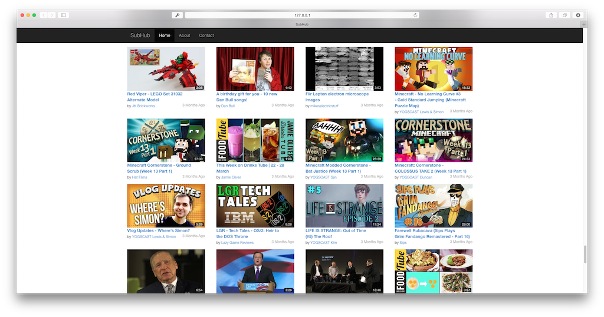

SubHub
======

A better way to browse your YouTube subscriptions. This is a JavaScript web app that allows you to easily browse, filter
and organise your YouTube subscription feed. It makes API calls to a Go backend which scrapes the YouTube API and maintains
an updated mirror of video metadata for a subset of channels in a structure more suitable for keeping track of subscriptions.

Right now this is a self-hosted prototype solution, with all the subscriptions being those of the user whose Google API client
secrets have been provided.



Setup
-----

First download and install Go from [here](http://golang.org). Then enter the following command to install subhub:

    go get github.com/sean-duffy/subhub

When subhub and its requirements are installed, to run the server do:

    ./subhub

This will host the webapp at ```http://127.0.0.1:8000```. To update the database, which is necessary for up to date subscription data, do:

    ./scripts/run

This should be put on a cronjob to be run with the desired frequency, currently I use every hour but
this will certainly change in production.
